# Boas-vindas ao repositório do projeto Tela de Login da Rede Social

<p align="center">
  <a href="https://www.figma.com/file/7aGNlYuGlPZ8mRe8ziPEq2/%5BAndroid%5D%5BSe%C3%A7%C3%A3o-2%5D-Tela-de-Login?type=design&node-id=11-1833&mode=design">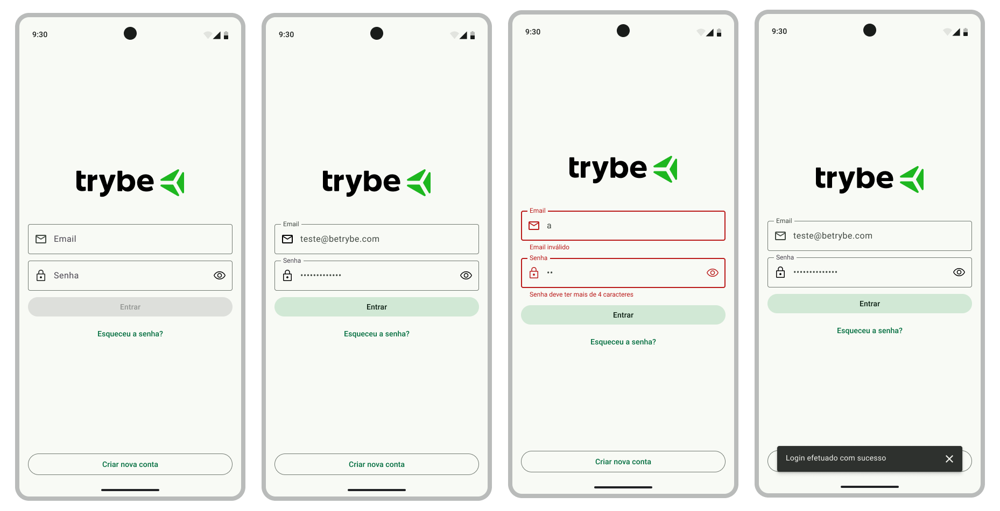</a>
</p>

Para realizar o projeto, atente-se a cada passo descrito a seguir, e se tiver **qualquer dúvida**, nos envie no _Slack_ da turma! #vqv 🚀

Aqui, você vai encontrar os detalhes de como estruturar o desenvolvimento do seu projeto a partir desse repositório, utilizando uma branch específica e um _Pull Request_ para colocar seus códigos.

<br />

## Termos e acordos

Ao iniciar este projeto, você concorda com as diretrizes do [Código de Conduta e do Manual da Pessoa Estudante da Trybe](https://app.betrybe.com/learn/student-manual/codigo-de-conduta-da-pessoa-estudante).

<br />

## Entregáveis

<details><summary><strong>🤷🏽‍ Como entregar</strong></summary><br />

Para entregar o seu projeto, você deverá criar um _Pull Request_ neste repositório.

Lembre-se que você pode consultar nosso conteúdo sobre [Git & GitHub](https://app.betrybe.com/learn/course/5e938f69-6e32-43b3-9685-c936530fd326/module/f04cdb21-382e-4588-8950-3b1a29afd2dd/section/876a615b-f578-4d65-a820-de9f3e5e57db/lesson/be8632bf-7bb7-4c01-a5d9-7aadac3a58f0) sempre que precisar!
<br /></details>

<details><summary><strong>🧑‍💻 O que deverá ser desenvolvido</strong></summary><br />

Você será responsável por desenvolver a tela de login de uma rede social. Essa tela de login contém apenas o layout e as validações de interface, não se conectando nesse momento com nenhuma API.

<br /></details>

<details><summary><strong>📝 Habilidades a serem trabalhadas </strong></summary><br />

Neste projeto, verificaremos se você é capaz de:

- Utilizar Kotlin para manipular os elementos visuais do Android;
- Utilizar Kotlin para desenvolver regras de negócio da interface;
- Construir layout via XML;
- Posicionar os elementos visuais com ViewGroup;

<br /></details>

<details><summary><strong>🗓 Data de Entrega</strong></summary><br />

- Este projeto é individual;

- Será 1 dia de projeto;

- Data para entrega final do projeto: `13/11/2023 14:00`.

<br /></details>

## Orientações

<details><summary><strong>‼ Antes de começar a desenvolver</strong></summary><br /> 

#### 1. Clone o repositório

- Use o comando: `git clone git@github.com:tryber/android-029-android-projeto-login-social.git`

- Entre na pasta do repositório que você acabou de clonar:

    - `cd android-029-android-projeto-login-social`

#### 2. Instale as dependências

- Entre no arquivo `build.gradle` localizado dentro do diretório **app**

- Clique no botão `Sync Now` caso ele exista; se a opção não estiver disponível, significa que a sincronização automática já foi realizada ao abrir o Android Studio.

#### 3. Crie uma branch a partir da branch `main`

- Verifique que você está na branch `main`. Use o comando `git branch` para isso

- Se você não estiver, mude para a branch `main`. Use `git checkout main`

- Agora, crie uma branch à qual você vai submeter os `commits` do seu projeto.

    - Você deve criar uma branch no formato `{seu-nome-e-sobrenome}-{nome-do-projeto}`. Exemplo: `gabriel-oliva-projeto-login-social`

    - Exemplo: `git checkout -b gabriel-oliva-projeto-login-social`

#### 4. Adicione as mudanças ao _stage_ do Git e faça um `commit`

- Verifique que as mudanças ainda não estão no _stage_. O comando `git status` irá mostrar essa informação para você, mostrando os arquivos em vermelho

- Adicione o novo arquivo ao _stage_ do Git. Use `git add .` para adicionar **todos** os arquivos ao _stage_ ou `git add nome-do-arquivo` para adicionar um arquivo específico

- Verifique com o comando `git status` que os arquivos adicionados ao _stage_ agora estão verde

- Faça o `commit` inicial com o comando `git commit -m "Iniciando o projeto"`

- Verifique com `git status` que você não possui mais alterações para serem commitadas. A mensagem _nothing to commit_ ou similar deve aparecer

- Adicione a sua branch com o novo `commit` ao repositório remoto com o comando `git push`. Exemplo: `git push -u origin gabriel-oliva-projeto-login-social`

#### 5. Crie um novo `Pull Request` _(PR)_

- Vá até a página de _Pull Requests_ do [repositório no GitHub](https://github.com/tryber/android-029-android-projeto-login-social/pulls)

- Clique no botão verde _"New pull request"_

- Clique na caixa de seleção _"Compare"_ e escolha a sua branch **com atenção**

- Coloque um título para o seu _Pull Request_

- Exemplo: _"[Gabriel Oliva] Projeto Login Social"_

- Clique no botão verde _"Create pull request"_

- Adicione uma descrição para o _Pull Request_, um título nítido que o identifique, e clique no botão verde _"Create pull request"_

- Volte até a [página de _Pull Requests_ do repositório](https://github.com/tryber/android-029-android-projeto-login-social/pulls) e confira se o seu _Pull Request_ está criado

<br /></details>

<details><summary><strong>⌨️ Durante o desenvolvimento</strong></summary><br />

Faça `commits` das alterações que você fizer no código regularmente, pois assim você garante visibilidade para o time da Trybe e treina essa prática para o mercado de trabalho. 😀

- Lembre-se de sempre após um (ou alguns) `commits` atualizar o repositório remoto

- Os comandos que você utilizará com mais frequência são:

    - `git status` _(para verificar o que está em vermelho - fora do stage - e o que está em verde - no stage)_;
    - `git add` _(para adicionar arquivos ao stage do Git)_;
    - `git commit` _(para criar um commit com os arquivos que estão no stage do Git)_;
    - `git push -u origin nome-da-branch` _(para enviar o commit para o repositório remoto na primeira vez que fizer o `push` de uma nova branch)_;
    - `git push` _(para enviar o commit para o repositório remoto após o passo anterior)_.

<br /></details>

<details><summary><strong>🎛 Linter</strong></summary><br />

Usaremos o [Ktlint](https://pinterest.github.io/ktlint/) para fazer o lint do seu código.

Este projeto já vem com as dependências relacionadas ao _linter_ configuradas no arquivo `build.gradle`, lembre-se de instalá-las.

Para poder rodar o `Ktlint` de forma local, rode o comando de acordo com o sistema operacional:

Mac ou Linux:
```bash
./gradlew ktlintCheck
```

Windows:
```bash
gradlew ktlintCheck
```

Se a análise do `Ktlint` encontrar problemas no seu código, tais problemas serão mostrados no seu terminal.

<br /></details>

<details><summary><strong>👀 Analisador estático de código</strong></summary><br />

Usaremos o [Detekt](https://detekt.dev/) para fazer a análise estática do seu código.

Este projeto já vem com as dependências relacionadas ao _linter_ configuradas no arquivo `build.gradle`, lembre-se de instalá-las.

Para poder rodar o `Detekt` de forma local, rode o comando de acordo com o sistema operacional:

Mac ou Linux:
```bash
./gradlew detekt
```

Windows:
```bash
gradlew detekt
```

Se a análise do `Ktlint` encontrar problemas no seu código, tais problemas serão mostrados no seu terminal.
</details>

<details>
<summary><strong>🛠 Testes</strong></summary><br />

Todos os requisitos do projeto serão testados automaticamente por meio do `Espresso`, uma ferramenta que testa interfaces. Você pode rodar o teste instrumentado no Android Studio ou via linha de comando.

#### Android Studio

Abra a aba `Run` e selecione o arquivo de teste, conforme exemplo abaixo:


#### Linha de comando

- Abra o emulador

- Execute o comando
  - Mac ou Linux: `./gradlew connectedAndroidTest`
  - Windows: `gradlew connectedAndroidTest`

#### Avaliação

Os requisitos do seu projeto são avaliados automaticamente. Para verificar se a sua avaliação foi computada com sucesso, você pode verificar os **detalhes da execução do avaliador**:

- Na página do seu _Pull Request_, acima do "botão de merge", procure por `Evaluator job` e clique no link `Details`;

- Na página que se abrirá, procure pela linha `Evaluator step` e clique nela;

- Caso tenha dúvidas, peça ajuda no _Slack_.

⚠️ **O avaliador automático não necessariamente avalia seu projeto na ordem em que os requisitos aparecem no README. Isso acontece para deixar o processo de avaliação mais rápido. Então, não se assuste se isso acontecer, ok?**

O não cumprimento de um requisito, total ou parcialmente, impactará em sua avaliação.
<br /></details>

<details>
<summary><strong>🏗 Estrutura do projeto</strong></summary> <br />

O seu Pull Request deverá conter, obrigatoriamente, os arquivos `MainActivity.kt` e `activity_main.xml`.

As imagens pedidas no projeto estão dentro da pasta _/res_.

⚠️ É importante que seus arquivos tenham exatamente estes nomes!

Caso sinta a necessidade de adicionar outros arquivos além destes, sinta-se à vontade.

<br /></details>

# Requisitos do projeto

## `1 - Crie a estrutura inicial da tela com a logo da rede social`

A tela de login terá seu conteúdo principal dentro de um container, que será um LinearLayout. Nesse primeiro requisito vamos fazer a configuração inicial do container e inserir o primeiro elemento que ficará dentro dele: a logo da rede social.

<details><summary><strong>️📱 Tela</strong></summary><br />

|                                                               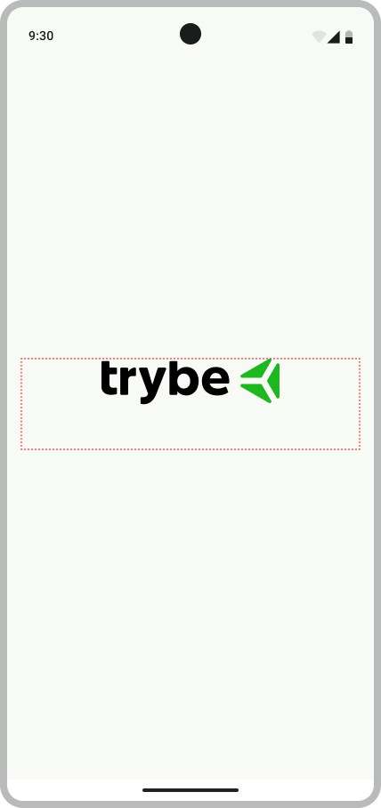                                                                |
|:-------------------------------------------------------------------------------------------------------------------------------------------------------:|
| [Figma](https://www.figma.com/file/7aGNlYuGlPZ8mRe8ziPEq2/%5BAndroid%5D%5BSe%C3%A7%C3%A3o-2%5D-Tela-de-Login?type=design&node-id=54995-263&mode=design) |

<br /></details>

<details><summary><strong>👩‍💻 Regras de implementação</strong></summary>

### Onde desenvolver

- O arquivo que você implementará o layout deve se chamar `activity_main.xml` e deve estar dentro do diretório `src/res/layout`;

### Estrutura da tela

```
App
└── ConstraintLayout
    └── LinearLayout
        └── Imagem da logo
```

### Regras de negócio

#### ConstraintLayout

- **Configuração**
    - Deve ser o elemento raíz da tela
    - Deve ter o id `main`
- **Layout**
    - Largura e altura devem ser a mesma do elemento pai

#### LinearLayout

- **Configuração**
    - Deve ser elemento filho do ConstraintLayout
    - Deve ter o id `linear_container`
    - Orientação deve ser `vertical`
- **Layout**
    - Largura deve ser a mesma do elemento pai
    - Altura deve envolver o conteúdo
    - A margem esquerda e direita deve ser de `16dp`
- **Constraints**:
    - A constraint `top` deve ser ancorada no `top` do elemento pai
    - A constraint `bottom` deve ser ancorada no `bottom` do elemento pai
    - A constraint `right` deve ser ancorada no `right` do elemento pai
    - A constraint `left` deve ser ancorada no `left` do elemento pai

#### Imagem da logo

- **Configuração**
  - O elemento deve ser uma [ImageView](https://developer.android.com/reference/android/widget/ImageView)
  - Deve ser elemento filho do LinearLayout
  - Deve ter o id `logo`
  - A imagem da logo deve ser a que se encontra na página `Requisito 1` do [figma](https://www.figma.com/file/7aGNlYuGlPZ8mRe8ziPEq2/%5BAndroid%5D%5BSe%C3%A7%C3%A3o-2%5D-Tela-de-Login?type=design&node-id=54995-263&mode=design)
- **Layout**
  - Largura e altura devem envolver o conteúdo
  - A margem de baixo deve ter `50dp`
  - A imagem deve ser centralizada horizontalmente

### O que será testado

- O elemento ConstraintLayout existe
- O elemento LinearLayout existe e é filho do elemento ConstraintLayout
- O elemento ImageView existe e é filho do elemento LinearLayout
- O elemento ImageView possui imagem

<br/></details>

## `2 - Crie o campo de Email`

Para conseguir se identificar, a pessoa usuária precisa de um campo para inserir o email que está cadastrado em sua rede social.

<details><summary><strong>️📱 Tela</strong></summary><br />

|                                                            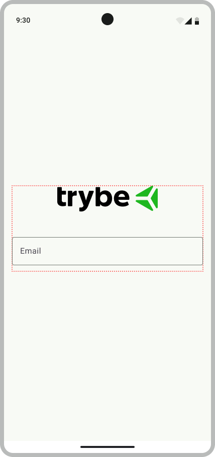                                                            |
|:-------------------------------------------------------------------------------------------------------------------------------------------------------:|
| [Figma](https://www.figma.com/file/7aGNlYuGlPZ8mRe8ziPEq2/%5BAndroid%5D%5BSe%C3%A7%C3%A3o-2%5D-Tela-de-Login?type=design&node-id=55007-321&mode=design) |

<br /></details>

<details><summary><strong>👩‍💻 Regras de implementação</strong></summary>

### Onde desenvolver

- O arquivo que você implementará o layout deve se chamar `activity_main.xml` e deve estar dentro do diretório `src/res/layout`;

### Estrutura da tela

```
App
└── ConstraintLayout
    └── LinearLayout
        └── Imagem da logo
        └── Campo de email
```

### Regras de negócio

#### Campo de email

- **Configuração**
  - O campo de email deve ser do [Material Design 3](https://m3.material.io/components/text-fields/overview)
  - O tipo do campo de email deve ser `outlined`
  - Deve ser elemento filho do LinearLayout
  - Deve ter o id `email_text_input_layout`
  - O campo de email deve vir `habilitado`
- **Layout**
  - Largura deve ser a mesma do elemento pai
  - Altura deve envolver o conteúdo
  - A margem de baixo deve ter `12dp`
- **Atributos**
  - A label do campo deve ser `Email`
  - O campo deve ter um ícone de início. A imagem desse ícone se encontra no [figma](https://www.figma.com/file/7aGNlYuGlPZ8mRe8ziPEq2/%5BAndroid%5D%5BSe%C3%A7%C3%A3o-2%5D-Tela-de-Login?type=design&node-id=55007-321&mode=design) 
  - O tipo de input do campo deve ser de `endereço de email`

### O que será testado

- O campo de email existe e é apresentado
- O campo de email é filho do elemento LinearLayout
- A campo de email possui o texto _"Email"_
- O campo de email está habilitado
- O campo de email está abaixo da imagem com a logo
- O tipo de input do campo é do tipo `textEmailAddress`
- O campo de email possui um ícone de início

<br/></details>

## `3 - Crie o campo de Senha`

Para conseguir se autenticar, a pessoa usuária precisa de um campo para inserir sua senha.

<details><summary><strong>️📱 Tela</strong></summary><br />

|                                                             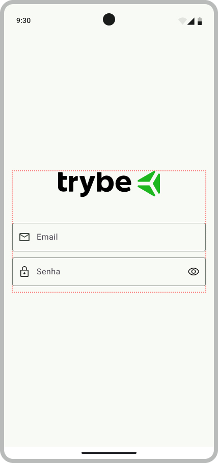                                                            |
|:--------------------------------------------------------------------------------------------------------------------------------------------------------:|
| [Figma](https://www.figma.com/file/7aGNlYuGlPZ8mRe8ziPEq2/%5BAndroid%5D%5BSe%C3%A7%C3%A3o-2%5D-Tela-de-Login?type=design&node-id=55013-2065&mode=design) |

<br /></details>

<details><summary><strong>👩‍💻 Regras de implementação</strong></summary>

### Onde desenvolver

- O arquivo que você implementará o layout deve se chamar `activity_main.xml` e deve estar dentro do diretório `src/res/layout`;

### Estrutura da tela

```
App
└── ConstraintLayout
    └── LinearLayout
        ├── Imagem de logo
        ├── Campo de email
        └── Campo de senha
```

### Regras de negócio

#### Campo de senha

- **Configuração**
  - O campo de senha deve ser do [Material Design 3](https://m3.material.io/components/text-fields/overview)
  - O tipo do campo de senha deve ser `outlined`
  - Deve ser elemento filho do LinearLayout
  - Deve ter o id `password_text_input_layout`
  - O campo de senha deve vir `habilitado`
- **Layout**
  - Largura deve ser a mesma do elemento pai
  - Altura deve envolver o conteúdo
  - A margem de baixo deve ter `12dp`
- **Atributos**
  - A label do campo deve ter ser `Senha`
  - O campo deve ter um ícone de início. A imagem desse ícone se encontra no [figma](https://www.figma.com/file/7aGNlYuGlPZ8mRe8ziPEq2/%5BAndroid%5D%5BSe%C3%A7%C3%A3o-2%5D-Tela-de-Login?type=design&node-id=55013-2065&mode=design)
  - O campo deve ter um ícone de final, que permite a visualização da senha ao ser tocado
  - O tipo de input do campo deve ser texto de senha

### O que será testado

- O campo de senha existe e é apresentado
- O campo de senha é filho do elemento LinearLayout
- A label do campo de senha possui o texto _"Senha"_
- O campo de senha está habilitado
- O campo de senha está abaixo do campo de email
- O input do campo é do tipo `textPassword`
- O campo de senha possui um ícone de início
- O campo de senha possui um ícone de final

<br/></details>

## `4 - Crie o botão de entrar`

Para conseguir validar os dados informados, a pessoa usuária precisa apertar o botão Entrar.

<details><summary><strong>️📱 Tela</strong></summary><br />

|                                                            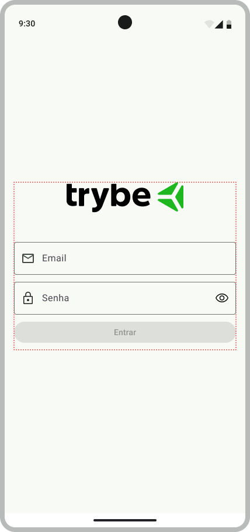                                                             |
|:--------------------------------------------------------------------------------------------------------------------------------------------------------:|
| [Figma](https://www.figma.com/file/7aGNlYuGlPZ8mRe8ziPEq2/%5BAndroid%5D%5BSe%C3%A7%C3%A3o-2%5D-Tela-de-Login?type=design&node-id=55014-2526&mode=design) |

<br /></details>

<details><summary><strong>👩‍💻 Regras de implementação</strong></summary>

### Onde desenvolver

- O arquivo que você implementará o layout deve se chamar `activity_main.xml` e deve estar dentro do diretório `src/res/layout`;

### Estrutura da tela

```
App
└── ConstraintLayout
    └── LinearLayout
        ├── Imagem de logo
        ├── Campo de email
        ├── Campo de senha
        └── Botão entrar
```

### Regras de negócio

#### Botão entrar

- **Configuração**
  - O botão deve ser do [Material Design 3](https://m3.material.io/components/buttons/overview)
  - O tipo do botão deve ser `filled`
  - Deve ser elemento filho do LinearLayout
  - Deve ter o id `login_button`
  - O botão deve vir `desabilitado`
- **Layout**
  - Largura deve ser a mesma do elemento pai
  - Altura deve envolver o conteúdo
  - A margem de baixo deve ter `12dp`
- **Atributos**
  - O texto da botão deve ser `Entrar`

### O que será testado

- O botão de entrar existe e é apresentado
- O botão de entrar é filho do elemento LinearLayout
- A botão possui o texto _"Entrar"_
- O botão está desabilitado
- O botão de entrar está abaixo da campo de email

<br/></details>

## `5 - Crie o botão de recuperar senha`

Caso a pessoa esqueça a senha, é necessário ter um botão que leva ela para a tela que permite a recuperação da conta.

<details><summary><strong>️📱 Tela</strong></summary><br />

|                                                            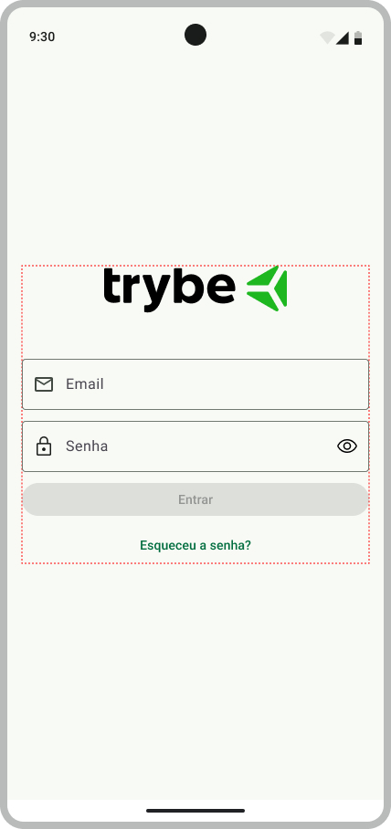                                                             |
|:--------------------------------------------------------------------------------------------------------------------------------------------------------:|
| [Figma](https://www.figma.com/file/7aGNlYuGlPZ8mRe8ziPEq2/%5BAndroid%5D%5BSe%C3%A7%C3%A3o-2%5D-Tela-de-Login?type=design&node-id=55015-2588&mode=design) |

<br /></details>

<details><summary><strong>👩‍💻 Regras de implementação</strong></summary>

### Onde desenvolver

- O arquivo que você implementará o layout deve se chamar `activity_main.xml` e deve estar dentro do diretório `src/res/layout`;

### Estrutura da tela

```
App
└── ConstraintLayout
    └── LinearLayout
        ├── Imagem de logo
        ├── Campo de email
        ├── Campo de senha
        ├── Botão entrar
        └── Botão recuperar senha
```

### Regras de negócio

#### Botão recuperar senha

- **Configuração**
  - O botão deve ser do [Material Design 3](https://m3.material.io/components/buttons/overview)
  - O tipo do botão deve ser `text`
  - Deve ser elemento filho do LinearLayout
  - Deve ter o id `forgot_password_button`
  - O botão deve vir `habilitado`
- **Layout**
  - Largura deve ser a mesma do elemento pai
  - Altura deve envolver o conteúdo
- **Atributos**
  - O texto da botão deve ser `Esqueceu a senha?`

### O que será testado

- O botão de recuperar a senha existe e é apresentado
- O botão de recuperar a senha é filho do elemento LinearLayout
- A botão possui o texto _"Esqueceu a senha?"_
- O botão está habilitado
- O botão de entrar está abaixo do botão de entrar

<br/></details>

## `6 - Crie o botão de cadastro`

Para pessoas que não possuem conta na rede social, é necessário ter um botão que leva ela para a tela que permita o cadastro.

<details><summary><strong>️📱 Tela</strong></summary><br />

|                                                            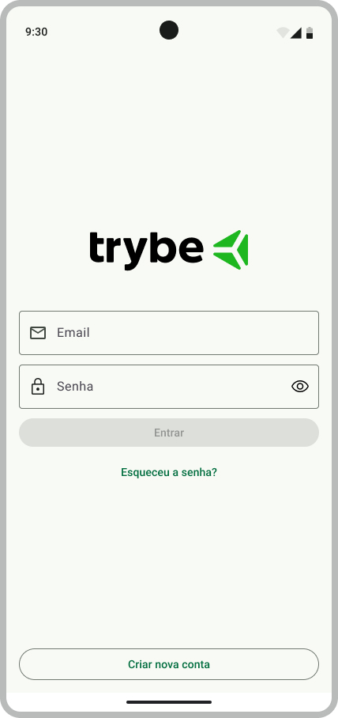                                                             |
|:--------------------------------------------------------------------------------------------------------------------------------------------------------:|
| [Figma](https://www.figma.com/file/7aGNlYuGlPZ8mRe8ziPEq2/%5BAndroid%5D%5BSe%C3%A7%C3%A3o-2%5D-Tela-de-Login?type=design&node-id=55016-2653&mode=design) |

<br /></details>

<details><summary><strong>👩‍💻 Regras de implementação</strong></summary>

### Onde desenvolver

- O arquivo que você implementará o layout deve se chamar `activity_main.xml` e deve estar dentro do diretório `src/res/layout`;

### Estrutura da tela

```
App
└── ConstraintLayout
    ├── LinearLayout
    │   ├── Imagem de logo
    │   ├── Campo de email
    │   ├── Campo de senha
    │   ├── Botão entrar
    │   └── Botão recuperar senha
    └── Botão cadastrar
```

### Regras de negócio

#### Botão cadastrar

- **Configuração**
  - O botão deve ser do [Material Design 3](https://m3.material.io/components/buttons/overview)
  - O tipo do botão deve ser `outlined`
  - Deve ser elemento filho do ConstraintLayout
  - Deve ter o id `sign_up_button`
  - O botão deve vir `habilitado`
- **Constraints**:
  - A constraint `bottom` deve ser ancorada no `bottom` do elemento pai
  - A constraint `right` deve ser ancorada no `right` do elemento pai
  - A constraint `left` deve ser ancorada no `left` do elemento pai
- **Layout**
  - Largura deve ser a mesma do elemento pai
  - O botão deve ter uma margem de 16dp para a parte esquerda, direita e em baixo
- **Atributos**
  - O texto da botão deve ser `Criar nova conta`

### O que será testado

- O botão de cadastrar existe e é apresentado
- O botão de cadastrar é filho do elemento ConstraintLayout
- A botão possui o texto _"Criar nova conta"_
- O botão está habilitado

<br/></details>

## `7 - Implemente a regra de habilitação do botão entrar`

O botão Entrar é desabilitado por padrão. Esse padrão é bem útil em termos de usabilidade, pois induz a pessoa a inserir as informações nos campos sem precisar apresentar algum tipo de mensagem. A partir do momento que os campos possuem alguma informação, o botão será habilitado.

<details><summary><strong>️📱 Tela</strong></summary><br />

|                                                            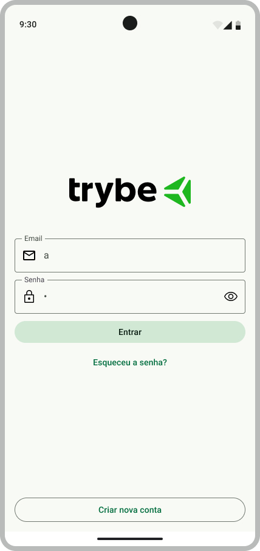                                                             |
|:--------------------------------------------------------------------------------------------------------------------------------------------------------:|
| [Figma](https://www.figma.com/file/7aGNlYuGlPZ8mRe8ziPEq2/%5BAndroid%5D%5BSe%C3%A7%C3%A3o-2%5D-Tela-de-Login?type=design&node-id=55018-2721&mode=design) |

<br /></details>

<details><summary><strong>👩‍💻 Regras de implementação</strong></summary>

### Onde desenvolver

- Você deverá implementar as validações na Activity. O arquivo deve se chamar `MainActivity.kt` e deve estar dentro do pacote `com.betrybe.sociallogin`

### Regras de negócio

Para o botão ser habilitado, as seguintes regras devem ser seguidas:

1. O campo de email deve ter, no mínimo, 1 caracter
2. O campo de senha deve ter, no mínimo, 1 caracter

### O que será testado

- Ao inserir 1 caracter no campo de email e nenhum no campo de senha, o botão de entrar deve estar `desabilitado`
- Ao inserir 1 caracter no campo de senha e nenhum no campo email, o botão de entrar deve estar `desabilitado`
- Ao inserir 1 caracter no campo de email e 1 caracter no campo de senha, o botão de entrar deve estar `habilitado`

<br/></details>

## `8 - Implemente a validação do campo de email`

As pessoas podem entrar com qualquer valor no campo de email. Porém fazer uma requisição de autenticação com email inválido pode ser muito custoso pro nosso back-end. Pensando nisso, vamos fazer a validação no aplicativo! Caso o email não esteja no formato correto, o campo de email apresentará uma mensagem de erro.

<details><summary><strong>️📱 Tela</strong></summary><br />

|                                                            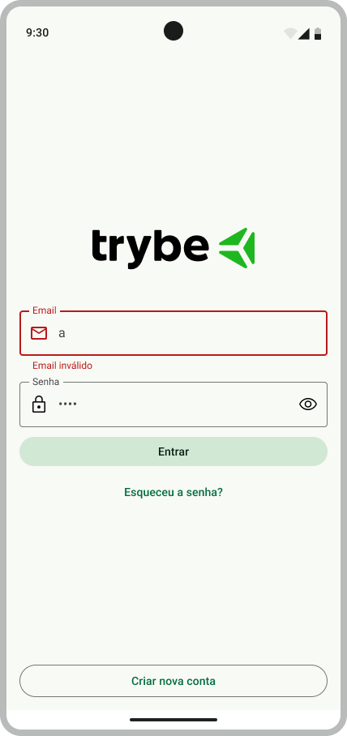                                                             |
|:--------------------------------------------------------------------------------------------------------------------------------------------------------:|
| [Figma](https://www.figma.com/file/7aGNlYuGlPZ8mRe8ziPEq2/%5BAndroid%5D%5BSe%C3%A7%C3%A3o-2%5D-Tela-de-Login?type=design&node-id=55019-2896&mode=design) |

<br /></details>

<details><summary><strong>👩‍💻 Regras de implementação</strong></summary>

### Onde desenvolver

- Você deverá implementar as validações na Activity. O arquivo deve se chamar `MainActivity.kt` e deve estar dentro do pacote `com.betrybe.sociallogin`

### Regras de negócio

- A regra de validação de email obedecerá o formato: `{conjunto A}@{conjunto B}.{conjunto C}`, onde:
  - conjunto A: letras de A a Z, números de 0 a 9 e a pontuação `.`
  - conjunto B: letras de A a Z
  - conjunto A: letras de A a Z
- O momento para fazer a validação será após o clique no botão Entrar
- Caso o email seja inválido, o campo deve apresentar a mensagem de erro com o texto `Email inválido`

### O que será testado

- Ao inserir um email inválido no campo de email e algum caracter no campo de senha, o campo de email deverá mostrar a mensagem de erro _"Email inválido"_ 
- Ao inserir um email válido no campo de email e algum caracter no campo de senha, o campo de email não deverá mostrar a mensagem de erro

<br/></details>

## `9 - Implemente a validação do campo de senha`

As pessoas podem entrar com qualquer valor no campo de senha. Pensando nisso, vamos fazer uma validação básica de senha, verificando se há uma quantidade mínima de caracteres. Caso não tenha, o campo de senha apresentará uma mensagem de erro.

<details><summary><strong>️📱 Tela</strong></summary><br />

|                                                            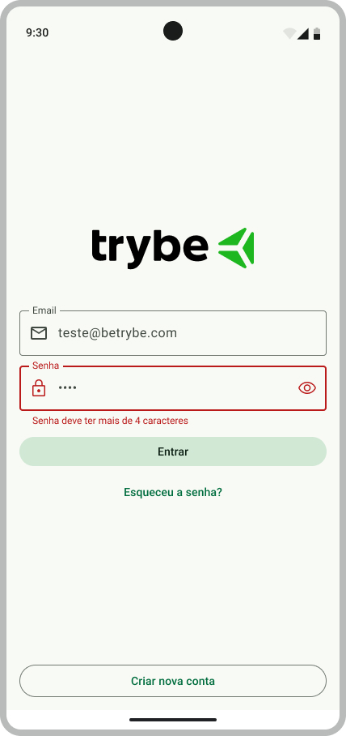                                                             |
|:--------------------------------------------------------------------------------------------------------------------------------------------------------:|
| [Figma](https://www.figma.com/file/7aGNlYuGlPZ8mRe8ziPEq2/%5BAndroid%5D%5BSe%C3%A7%C3%A3o-2%5D-Tela-de-Login?type=design&node-id=55019-3030&mode=design) |

<br /></details>

<details><summary><strong>👩‍💻 Regras de implementação</strong></summary>

### Onde desenvolver

- Você deverá implementar as validações na Activity. O arquivo deve se chamar `MainActivity.kt` e deve estar dentro do pacote `com.betrybe.sociallogin`

### Regras de negócio

- A senha deve ser `maior que` 4 caracteres
- O momento para fazer a validação será após o clique no botão Entrar
- Caso a senha não obedeça a regra, o campo deve apresentar a mensagem de erro com o texto `Senha deve ter mais de 4 caracteres`

### O que será testado

- Ao inserir um email válido e uma senha inválida, o campo de senha deverá mostrar a mensagem de erro _"Senha deve ter mais de 4 caracteres"_
- Ao inserir um email válido e uma senha válida, o campo de email não deverá mostrar a mensagem de erro

<br/></details>

## `10 - Implemente uma mensagem de sucesso no login`

Como estamos desenvolvendo a tela de Login de forma isolada, precisamos apresentar uma mensagem de sucesso caso o login seja feito com sucesso.

<details><summary><strong>️📱 Tela</strong></summary><br />

|                                                            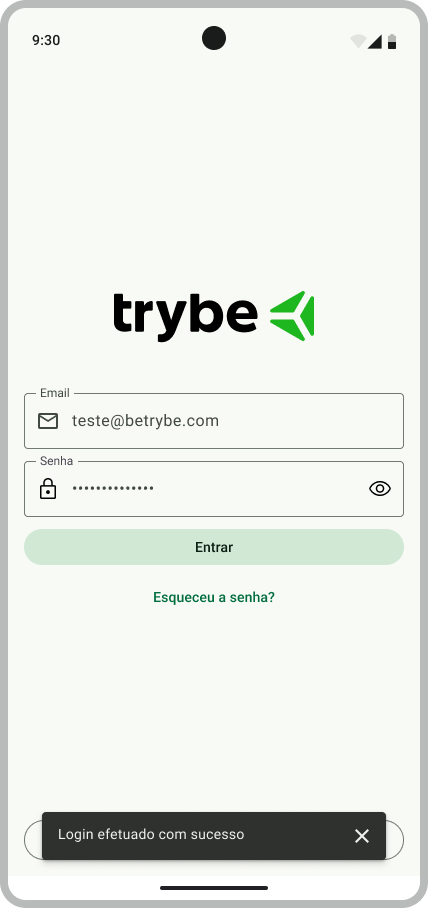                                                            |
|:--------------------------------------------------------------------------------------------------------------------------------------------------------:|
| [Figma](https://www.figma.com/file/7aGNlYuGlPZ8mRe8ziPEq2/%5BAndroid%5D%5BSe%C3%A7%C3%A3o-2%5D-Tela-de-Login?type=design&node-id=55023-3163&mode=design) |

<br /></details>

<details><summary><strong>👩‍💻 Regras de implementação</strong></summary>

### Onde desenvolver

- Você deverá implementar as validações na Activity. O arquivo deve se chamar `MainActivity.kt` e deve estar dentro do pacote `com.betrybe.sociallogin`

### Regras de negócio

- Ao pressionar o botão Entrar e o email e a senha estiverem corretos, uma [Snackbar](https://m3.material.io/components/snackbar/overview) será apresentada
- O texto da Snackbar deve ser "Login efetuado com sucesso"
- 

### O que será testado

- Ao inserir um email válido e uma senha válida, a mensagem _"Login efetuado com sucesso"_ é apresentada

<br/></details>

---

<details>
<summary><strong>🗣 Nos dê feedbacks sobre o projeto!</strong></summary><br />

Ao finalizar e submeter o projeto, não se esqueça de avaliar sua experiência preenchendo o formulário.
**Leva menos de 3 minutos!**

[Formulário de avaliação do projeto](https://be-trybe.typeform.com/to/ZTeR4IbH#cohort_hidden=CH29-ANDROID&template=betrybe/android-0x-projeto-login-social)

<br /></details>

<details>
<summary><strong>🗂 Compartilhe seu portfólio!</strong></summary><br />

Você sabia que o LinkedIn é a principal rede social profissional e compartilhar o seu aprendizado lá é muito importante para quem deseja construir uma carreira de sucesso? Compartilhe esse projeto no seu LinkedIn, marque o perfil da Trybe (@trybe) e mostre para a sua rede toda a sua evolução.

<br /></details>

<br />
